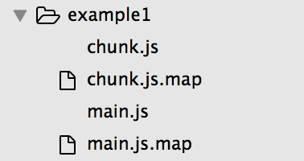

## 1.commonschunkplugin插件的使用
这篇文章告诉了我们CommonsChunkPlugin插件是如何使用的，其详细论述了每一个参数的具体用法以及某几个参数结合起来的作用。但是，如果你对CommonsChunkPlugin的打包原理比较感兴趣，你可以阅读我的[这篇文章](https://github.com/liangklfangl/commonchunkplugin-source-code),其以图解的方式进行了详细论述。但是，如果你最终是为了学习webpack全家桶的内容，我强烈建议您阅读一下[React全家桶完整实例](https://github.com/liangklfangl/react-universal-bucket)，其包含了Webpack常见插件的使用，Babel打包的原理，React组件原理与服务端渲染，高阶组件等常见内容。废话不多说，请继续阅读下面内容。

### 单入口文件时候不能把引用多次的模块打印到commonChunkPlugin中

注意：`example1(对应于目录example1，修改webpack.config.js中的配置就可以了，以下例子相同)`

```js
var CommonsChunkPlugin = require("webpack/lib/optimize/CommonsChunkPlugin");
module.exports = {
  entry: 
  {
    main:process.cwd()+'/example1/main.js',
  },
  output: {
    path:process.cwd()+'/dest/example1',
    filename: '[name].js'
  },
  plugins: [
   new CommonsChunkPlugin({
       name:"chunk",
       minChunks:2
   })
  ]
};
```

虽然在example1中chunk2被引用了两次，但是最终并没有打包到chunk.js中，我们看看chunk.js中的内容:

```js
/******/ (function(modules) { // webpackBootstrap
/******/    // install a JSONP callback for chunk loading
/******/    var parentJsonpFunction = window["webpackJsonp"];
/******/    window["webpackJsonp"] = function webpackJsonpCallback(chunkIds, moreModules) {
/******/        // add "moreModules" to the modules object,
/******/        // then flag all "chunkIds" as loaded and fire callback
/******/        var moduleId, chunkId, i = 0, callbacks = [];
/******/        for(;i < chunkIds.length; i++) {
/******/            chunkId = chunkIds[i];
/******/            if(installedChunks[chunkId])
/******/                callbacks.push.apply(callbacks, installedChunks[chunkId]);
/******/            installedChunks[chunkId] = 0;
/******/        }
/******/        for(moduleId in moreModules) {
/******/            modules[moduleId] = moreModules[moduleId];
/******/        }
/******/        if(parentJsonpFunction) parentJsonpFunction(chunkIds, moreModules);
/******/        while(callbacks.length)
/******/            callbacks.shift().call(null, __webpack_require__);
/******/        if(moreModules[0]) {
/******/            installedModules[0] = 0;
/******/            return __webpack_require__(0);
/******/        }
/******/    };

/******/    // The module cache
/******/    var installedModules = {};

/******/    // object to store loaded and loading chunks
/******/    // "0" means "already loaded"
/******/    // Array means "loading", array contains callbacks
/******/    var installedChunks = {
/******/        1:0
/******/    };

/******/    // The require function
/******/    function __webpack_require__(moduleId) {

/******/        // Check if module is in cache
/******/        if(installedModules[moduleId])
/******/            return installedModules[moduleId].exports;

/******/        // Create a new module (and put it into the cache)
/******/        var module = installedModules[moduleId] = {
/******/            exports: {},
/******/            id: moduleId,
/******/            loaded: false
/******/        };

/******/        // Execute the module function
/******/        modules[moduleId].call(module.exports, module, module.exports, __webpack_require__);

/******/        // Flag the module as loaded
/******/        module.loaded = true;

/******/        // Return the exports of the module
/******/        return module.exports;
/******/    }

/******/    // This file contains only the entry chunk.
/******/    // The chunk loading function for additional chunks
/******/    __webpack_require__.e = function requireEnsure(chunkId, callback) {
/******/        // "0" is the signal for "already loaded"
/******/        if(installedChunks[chunkId] === 0)
/******/            return callback.call(null, __webpack_require__);

/******/        // an array means "currently loading".
/******/        if(installedChunks[chunkId] !== undefined) {
/******/            installedChunks[chunkId].push(callback);
/******/        } else {
/******/            // start chunk loading
/******/            installedChunks[chunkId] = [callback];
/******/            var head = document.getElementsByTagName('head')[0];
/******/            var script = document.createElement('script');
/******/            script.type = 'text/javascript';
/******/            script.charset = 'utf-8';
/******/            script.async = true;

/******/            script.src = __webpack_require__.p + "" + chunkId + "." + ({"0":"main"}[chunkId]||chunkId) + ".js";
/******/            head.appendChild(script);
/******/        }
/******/    };

/******/    // expose the modules object (__webpack_modules__)
/******/    __webpack_require__.m = modules;

/******/    // expose the module cache
/******/    __webpack_require__.c = installedModules;

/******/    // __webpack_public_path__
/******/    __webpack_require__.p = "";
/******/ })
/************************************************************************/
/******/ ([]);
```

打包成的main.js中内容是:

```js
webpackJsonp([0,1],[
/* 0 */
/***/ function(module, exports, __webpack_require__) {
    __webpack_require__(1);
    __webpack_require__(2);
/***/ },
/* 1 */
/***/ function(module, exports, __webpack_require__) {

    __webpack_require__(2);
    var chunk1=1;
    exports.chunk1=chunk1;

/***/ },
/* 2 */
/***/ function(module, exports) {
    var chunk2=1;
    exports.chunk2=chunk2;

/***/ }
]);
```

### 多入口文件时候能把引用多次的模块打印到commonChunkPlugin中

在example2中我们配置了如下:

```js
minChunks:2
```

我们两个入口文件中公有的chunk1.js和chunk2.js被打印到chunk.js中!

```js
/******/ (function(modules) { // webpackBootstrap
/******/    // install a JSONP callback for chunk loading
/******/    var parentJsonpFunction = window["webpackJsonp"];
/******/    window["webpackJsonp"] = function webpackJsonpCallback(chunkIds, moreModules) {
/******/        // add "moreModules" to the modules object,
/******/        // then flag all "chunkIds" as loaded and fire callback
/******/        var moduleId, chunkId, i = 0, callbacks = [];
/******/        for(;i < chunkIds.length; i++) {
/******/            chunkId = chunkIds[i];
/******/            if(installedChunks[chunkId])
/******/                callbacks.push.apply(callbacks, installedChunks[chunkId]);
/******/            installedChunks[chunkId] = 0;
/******/        }
/******/        for(moduleId in moreModules) {
/******/            modules[moduleId] = moreModules[moduleId];
/******/        }
/******/        if(parentJsonpFunction) parentJsonpFunction(chunkIds, moreModules);
/******/        while(callbacks.length)
/******/            callbacks.shift().call(null, __webpack_require__);
/******/        if(moreModules[0]) {
/******/            installedModules[0] = 0;
/******/            return __webpack_require__(0);
/******/        }
/******/    };

/******/    // The module cache
/******/    var installedModules = {};

/******/    // object to store loaded and loading chunks
/******/    // "0" means "already loaded"
/******/    // Array means "loading", array contains callbacks
/******/    var installedChunks = {
/******/        2:0
/******/    };

/******/    // The require function
/******/    function __webpack_require__(moduleId) {

/******/        // Check if module is in cache
/******/        if(installedModules[moduleId])
/******/            return installedModules[moduleId].exports;

/******/        // Create a new module (and put it into the cache)
/******/        var module = installedModules[moduleId] = {
/******/            exports: {},
/******/            id: moduleId,
/******/            loaded: false
/******/        };

/******/        // Execute the module function
/******/        modules[moduleId].call(module.exports, module, module.exports, __webpack_require__);

/******/        // Flag the module as loaded
/******/        module.loaded = true;

/******/        // Return the exports of the module
/******/        return module.exports;
/******/    }

/******/    // This file contains only the entry chunk.
/******/    // The chunk loading function for additional chunks
/******/    __webpack_require__.e = function requireEnsure(chunkId, callback) {
/******/        // "0" is the signal for "already loaded"
/******/        if(installedChunks[chunkId] === 0)
/******/            return callback.call(null, __webpack_require__);

/******/        // an array means "currently loading".
/******/        if(installedChunks[chunkId] !== undefined) {
/******/            installedChunks[chunkId].push(callback);
/******/        } else {
/******/            // start chunk loading
/******/            installedChunks[chunkId] = [callback];
/******/            var head = document.getElementsByTagName('head')[0];
/******/            var script = document.createElement('script');
/******/            script.type = 'text/javascript';
/******/            script.charset = 'utf-8';
/******/            script.async = true;

/******/            script.src = __webpack_require__.p + "" + chunkId + "." + ({"0":"main","1":"main1"}[chunkId]||chunkId) + ".js";
/******/            head.appendChild(script);
/******/        }
/******/    };

/******/    // expose the modules object (__webpack_modules__)
/******/    __webpack_require__.m = modules;

/******/    // expose the module cache
/******/    __webpack_require__.c = installedModules;

/******/    // __webpack_public_path__
/******/    __webpack_require__.p = "";
/******/ })
/************************************************************************/
/******/ ([
/* 0 */,
/* 1 */
/***/ function(module, exports, __webpack_require__) {

    __webpack_require__(2);
    var chunk1=1;
    exports.chunk1=chunk1;

/***/ },
/* 2 */
/***/ function(module, exports) {

    var chunk2=1;
    exports.chunk2=chunk2;
/***/ }
/******/ ]);
```


### 将公共业务模块与类库或框架分开打包

#### 例1

```js
var CommonsChunkPlugin = require("webpack/lib/optimize/CommonsChunkPlugin");
module.exports = {
    entry: {
        main: process.cwd()+'/example3/main.js',
        main1: process.cwd()+'/example3/main1.js',
        common1:["jquery"],
        common2:["vue"]
    },
    output: {
        path: process.cwd()+'/dest/example3',
        filename: '[name].js'
    },
    plugins: [
        new CommonsChunkPlugin({
            name: ["chunk",'common1','common2'],//对应于上面的entry的key
            minChunks:2
        })
    ]
};
```

上面的配置就可以把jquery,vue分别打包到一个独立的chunk中，分别为common1.js,common2.js。同时把main1,main的`公共业务模块`打包到chunk.js中,而其他非公共的业务代码全部保留在main.js和main1.js中。

注意：webpack用插件CommonsChunkPlugin进行打包的时候，将符合`引用次数(minChunks)`的模块打包到name参数的数组的第一个块里（chunk）,然后数组后面的块依次打包(`查找entry里的key,没有找到相关的key就生成一个空的块`)，最后一个块包含webpack生成的在浏览器上使用各个块的加载代码，所以页面上使用的时候最后一个块必须最先加载,我们看看最后一个块，也就是common2.js的内容头部：

```js
/******/ (function(modules) { // webpackBootstrap
/******/  // install a JSONP callback for chunk loading
/******/  var parentJsonpFunction = window["webpackJsonp"];
/******/  window["webpackJsonp"] = function webpackJsonpCallback(chunkIds, moreModules) {
/******/    // add "moreModules" to the modules object,
/******/    // then flag all "chunkIds" as loaded and fire callback
/******/    var moduleId, chunkId, i = 0, callbacks = [];
/******/    for(;i < chunkIds.length; i++) {
/******/      chunkId = chunkIds[i];
/******/      if(installedChunks[chunkId])
/******/        callbacks.push.apply(callbacks, installedChunks[chunkId]);
/******/      installedChunks[chunkId] = 0;
/******/    }
/******/    for(moduleId in moreModules) {
/******/      modules[moduleId] = moreModules[moduleId];
/******/    }
/******/    if(parentJsonpFunction) parentJsonpFunction(chunkIds, moreModules);
/******/    while(callbacks.length)
/******/      callbacks.shift().call(null, __webpack_require__);
/******/    if(moreModules[0]) {
/******/      installedModules[0] = 0;
/******/      return __webpack_require__(0);
/******/    }
/******/  };

/******/  // The module cache
/******/  var installedModules = {};

/******/  // object to store loaded and loading chunks
/******/  // "0" means "already loaded"
/******/  // Array means "loading", array contains callbacks
/******/  var installedChunks = {
/******/    1:0
/******/  };

/******/  // The require function
/******/  function __webpack_require__(moduleId) {

/******/    // Check if module is in cache
/******/    if(installedModules[moduleId])
/******/      return installedModules[moduleId].exports;

/******/    // Create a new module (and put it into the cache)
/******/    var module = installedModules[moduleId] = {
/******/      exports: {},
/******/      id: moduleId,
/******/      loaded: false
/******/    };

/******/    // Execute the module function
/******/    modules[moduleId].call(module.exports, module, module.exports, __webpack_require__);

/******/    // Flag the module as loaded
/******/    module.loaded = true;

/******/    // Return the exports of the module
/******/    return module.exports;
/******/  }

/******/  // This file contains only the entry chunk.
/******/  // The chunk loading function for additional chunks
/******/  __webpack_require__.e = function requireEnsure(chunkId, callback) {
/******/    // "0" is the signal for "already loaded"
/******/    if(installedChunks[chunkId] === 0)
/******/      return callback.call(null, __webpack_require__);

/******/    // an array means "currently loading".
/******/    if(installedChunks[chunkId] !== undefined) {
/******/      installedChunks[chunkId].push(callback);
/******/    } else {
/******/      // start chunk loading
/******/      installedChunks[chunkId] = [callback];
/******/      var head = document.getElementsByTagName('head')[0];
/******/      var script = document.createElement('script');
/******/      script.type = 'text/javascript';
/******/      script.charset = 'utf-8';
/******/      script.async = true;

/******/      script.src = __webpack_require__.p + "" + chunkId + "." + ({"0":"common1","2":"main","3":"main1","4":"chunk"}[chunkId]||chunkId) + ".js";
/******/      head.appendChild(script);
/******/    }
/******/  };

/******/  // expose the modules object (__webpack_modules__)
/******/  __webpack_require__.m = modules;

/******/  // expose the module cache
/******/  __webpack_require__.c = installedModules;

/******/  // __webpack_public_path__
/******/  __webpack_require__.p = "";

/******/  // Load entry module and return exports
/******/  return __webpack_require__(0);
/******/ })
/************************************************************************/
/******/ ([
/* 0 */
/***/ function(module, exports, __webpack_require__) {

  module.exports = __webpack_require__(2);

/***/ }])
```

看到这里你就会明白为什么他要最后加载了把。

#### 例2

```js
var CommonsChunkPlugin = require("webpack/lib/optimize/CommonsChunkPlugin");
module.exports = {
    entry: {
        main: process.cwd()+'/example4/main.js',
        main1: process.cwd()+'/example4/main1.js',
        jquery:["jquery"],
        vue:["vue"]
    },
    output: {
        path: process.cwd() + '/dest/example4',
        filename: '[name].js'
    },
    plugins: [
        new CommonsChunkPlugin({
            name: ["common","jquery","vue","load"],
            minChunks:2
        })
    ]
};
```

这样我们的业务共享代码会提取到common.js中，如下:

```js
webpackJsonp([4,5],[
//第一个参数是一个数组，数组中第一个元素是该chunkId，而其余元素是该chunk依赖的其他模块
/* 0 */,
/* 1 */,
/* 2 */
/***/ function(module, exports, __webpack_require__) {
  __webpack_require__(3);
  var chunk1=1;
  exports.chunk1=chunk1;

/***/ },
/* 3 */
/***/ function(module, exports) {

  var chunk2=1;
  exports.chunk2=chunk2;

/***/ }
]);
```

而我们的load.js中仅仅是用于加载其他chunk代码的函数,所以必须在最后加载才行：

```js
/******/ (function(modules) { // webpackBootstrap
/******/  // install a JSONP callback for chunk loading
/******/  var parentJsonpFunction = window["webpackJsonp"];
/******/  window["webpackJsonp"] = function webpackJsonpCallback(chunkIds, moreModules) {
/******/    // add "moreModules" to the modules object,
/******/    // then flag all "chunkIds" as loaded and fire callback
/******/    var moduleId, chunkId, i = 0, callbacks = [];
/******/    for(;i < chunkIds.length; i++) {
/******/      chunkId = chunkIds[i];
/******/      if(installedChunks[chunkId])
/******/        callbacks.push.apply(callbacks, installedChunks[chunkId]);
/******/        installedChunks[chunkId] = 0;
/******/    }
/******/    for(moduleId in moreModules) {
/******/      modules[moduleId] = moreModules[moduleId];
/******/    }
/******/    if(parentJsonpFunction) parentJsonpFunction(chunkIds, moreModules);
/******/    while(callbacks.length)
/******/      callbacks.shift().call(null, __webpack_require__);
/******/    if(moreModules[0]) {
/******/      installedModules[0] = 0;
/******/      return __webpack_require__(0);
/******/    }
/******/  };

/******/  // The module cache
/******/  var installedModules = {};

/******/  // object to store loaded and loading chunks
/******/  // "0" means "already loaded"
/******/  // Array means "loading", array contains callbacks
/******/  var installedChunks = {
/******/    5:0
/******/  };

/******/  // The require function
/******/  function __webpack_require__(moduleId) {

/******/    // Check if module is in cache
/******/    if(installedModules[moduleId])
/******/      return installedModules[moduleId].exports;

/******/    // Create a new module (and put it into the cache)
/******/    var module = installedModules[moduleId] = {
/******/      exports: {},
/******/      id: moduleId,
/******/      loaded: false
/******/    };

/******/    // Execute the module function
/******/    modules[moduleId].call(module.exports, module, module.exports, __webpack_require__);

/******/    // Flag the module as loaded
/******/    module.loaded = true;

/******/    // Return the exports of the module
/******/    return module.exports;
/******/  }

/******/  // This file contains only the entry chunk.
/******/  // The chunk loading function for additional chunks
/******/  __webpack_require__.e = function requireEnsure(chunkId, callback) {
/******/    // "0" is the signal for "already loaded"
/******/    if(installedChunks[chunkId] === 0)
/******/      return callback.call(null, __webpack_require__);

/******/    // an array means "currently loading".
/******/    if(installedChunks[chunkId] !== undefined) {
/******/      installedChunks[chunkId].push(callback);
/******/    } else {
/******/      // start chunk loading
/******/      installedChunks[chunkId] = [callback];
/******/      var head = document.getElementsByTagName('head')[0];
/******/      var script = document.createElement('script');
/******/      script.type = 'text/javascript';
/******/      script.charset = 'utf-8';
/******/      script.async = true;

/******/      script.src = __webpack_require__.p + "" + chunkId + "." + ({"0":"jquery","1":"main","2":"main1","3":"vue","4":"common"}[chunkId]||chunkId) + ".js";
/******/      head.appendChild(script);
/******/    }
/******/  };

/******/  // expose the modules object (__webpack_modules__)
/******/  __webpack_require__.m = modules;

/******/  // expose the module cache
/******/  __webpack_require__.c = installedModules;

/******/  // __webpack_public_path__
/******/  __webpack_require__.p = "";
/******/ })
/************************************************************************/
/******/ ([]);
```

### 参数minChunks: Infinity

下面的配置会把main.js和main1.js公共的业务代码打包到jquery.js中:

```js
var CommonsChunkPlugin = require("webpack/lib/optimize/CommonsChunkPlugin");
module.exports = {
    entry: {
        main: process.cwd()+'/example5/main.js',
        main1: process.cwd()+'/example5/main1.js',
        jquery:["jquery"]
        //minChunks: Infinity时候框架代码依然会被单独打包成一个文件
    },
    output: {
        path: process.cwd() + '/dest/example5',
        filename: '[name].js'
    },
    plugins: [
        new CommonsChunkPlugin({
            name: "jquery",
            minChunks:2//被引用两次及以上
        })
    ]
};
```

如果把上面的minChunks修改为Infinity，那么chunk1和chunk2(公有的业务逻辑部分,在main.js和main1.js中require进来)`都打包到main.js,main1.js里`，也就是共有逻辑不会抽取出来作为一个单独的chunk,而且也不会打包到jquery.js中(下面的chunks参数配置可以让共有的模块打包到jquery中)!注意：此处的jquery必须在最先加载，因为window.webpackJsonp函数是被打包到jquery.js中的!

### 参数chunks

下面的配置表示：只有在main.js和main1.js中都引用的模块才会被打包的到公共模块（这里即jquery.js）

```js
var CommonsChunkPlugin = require("webpack/lib/optimize/CommonsChunkPlugin");
module.exports = {
    entry: {
        main: process.cwd()+'/example6/main.js',
        main1: process.cwd()+'/example6/main1.js',
        jquery:["jquery"]
    },
    output: {
        path: process.cwd()  + '/dest/example6',
        filename: '[name].js'
    },
    plugins: [
        new CommonsChunkPlugin({
            name: "jquery",
            minChunks:2,
            chunks:["main","main1"]
        })
    ]
};

```


此时你会发现在我们的jquery.js的最后会打包进来我们的chunk1.js和chunk2.js

```js
/* 2 */
/***/ function(module, exports, __webpack_require__) {
  __webpack_require__(3);
  var chunk1=1;
  exports.chunk1=chunk1;

/***/ },
/* 3 */
/***/ function(module, exports) {
  var chunk2=1;
  exports.chunk2=chunk2;

/***/ }
```


## 2.从commonschunkplugin看Compiler对象

 首先我们运行example1中的代码，其中webpack配置如下(可以在配置文件中自己打开注释部分):
```js
var CommonsChunkPlugin = require("webpack/lib/optimize/CommonsChunkPlugin");
module.exports = {
  entry: 
  {
    main:process.cwd()+'/example1/main.js',
  },
  output: {
    path:process.cwd()+'/dest/example1',
    filename: '[name].js'
  },
  plugins: [
   new CommonsChunkPlugin({
       name:"chunk",
       minChunks:2
   })
  ]
};
```

我们看看控制台打印的Compiler对象内容:

```js
Compiler {
  _plugins: {},
  outputPath: '',
  outputFileSystem: null,
  inputFileSystem: null,
  recordsInputPath: null,
  recordsOutputPath: null,
  records: {},
  fileTimestamps: {},
  contextTimestamps: {},
  resolvers: 
   { normal: Tapable { _plugins: {}, fileSystem: null },
     loader: Tapable { _plugins: {}, fileSystem: null },
     context: Tapable { _plugins: {}, fileSystem: null } },
  parser: 
   Parser {
     _plugins: 
      { 'evaluate Literal': 
         [ { [Function]
             [length]: 1,
             [name]: '',
             [arguments]: null,
             [caller]: null,
             [prototype]: { [constructor]: [Circular] } },
           [length]: 1 ],
        'evaluate LogicalExpression': 
         [ { [Function]
             [length]: 1,
             [name]: '',
             [arguments]: null,
             [caller]: null,
             [prototype]: { [constructor]: [Circular] } },
           [length]: 1 ],
        'evaluate BinaryExpression': 
         [ { [Function]
             [length]: 1,
             [name]: '',
             [arguments]: null,
             [caller]: null,
             [prototype]: { [constructor]: [Circular] } },
           [length]: 1 ],
        'evaluate UnaryExpression': 
         [ { [Function]
             [length]: 1,
             [name]: '',
             [arguments]: null,
             [caller]: null,
             [prototype]: { [constructor]: [Circular] } },
           [length]: 1 ],
        'evaluate typeof undefined': 
         [ { [Function]
             [length]: 1,
             [name]: '',
             [arguments]: null,
             [caller]: null,
             [prototype]: { [constructor]: [Circular] } },
           [length]: 1 ],
        'evaluate Identifier': 
         [ { [Function]
             [length]: 1,
             [name]: '',
             [arguments]: null,
             [caller]: null,
             [prototype]: { [constructor]: [Circular] } },
           [length]: 1 ],
        'evaluate MemberExpression': 
         [ { [Function]
             [length]: 1,
             [name]: '',
             [arguments]: null,
             [caller]: null,
             [prototype]: { [constructor]: [Circular] } },
           [length]: 1 ],
        'evaluate CallExpression': 
         [ { [Function]
             [length]: 1,
             [name]: '',
             [arguments]: null,
             [caller]: null,
             [prototype]: { [constructor]: [Circular] } },
           [length]: 1 ],
        'evaluate CallExpression .replace': 
         [ { [Function]
             [length]: 2,
             [name]: '',
             [arguments]: null,
             [caller]: null,
             [prototype]: { [constructor]: [Circular] } },
           [length]: 1 ],
        'evaluate CallExpression .substr': 
         [ { [Function]
             [length]: 2,
             [name]: '',
             [arguments]: null,
             [caller]: null,
             [prototype]: { [constructor]: [Circular] } },
           [length]: 1 ],
        'evaluate CallExpression .substring': 
         [ { [Function]
             [length]: 2,
             [name]: '',
             [arguments]: null,
             [caller]: null,
             [prototype]: { [constructor]: [Circular] } },
           [length]: 1 ],
        'evaluate CallExpression .split': 
         [ { [Function]
             [length]: 2,
             [name]: '',
             [arguments]: null,
             [caller]: null,
             [prototype]: { [constructor]: [Circular] } },
           [length]: 1 ],
        'evaluate ConditionalExpression': 
         [ { [Function]
             [length]: 1,
             [name]: '',
             [arguments]: null,
             [caller]: null,
             [prototype]: { [constructor]: [Circular] } },
           [length]: 1 ],
        'evaluate ArrayExpression': 
         [ { [Function]
             [length]: 1,
             [name]: '',
             [arguments]: null,
             [caller]: null,
             [prototype]: { [constructor]: [Circular] } },
           [length]: 1 ] },
     options: undefined },
  options: 
   { entry: { main: '/Users/xxx/Desktop/commonsChunkPlugin_Config/example1/main.js' },
     output: 
      { path: '/Users/xxx/Desktop/commonsChunkPlugin_Config/dest/example1',
        filename: '[name].js',
        libraryTarget: 'var',
        sourceMapFilename: '[file].map[query]',
        hotUpdateChunkFilename: '[id].[hash].hot-update.js',
        hotUpdateMainFilename: '[hash].hot-update.json',
        crossOriginLoading: false,
        hashFunction: 'md5',
        hashDigest: 'hex',
        hashDigestLength: 20,
        sourcePrefix: '\t',
        devtoolLineToLine: false },
     plugins: 
      [ CommonsChunkPlugin {
          chunkNames: 'chunk',
          filenameTemplate: undefined,
          minChunks: 2,
          selectedChunks: undefined,
          async: undefined,
          minSize: undefined,
          ident: '/Users/xxx/Desktop/commonsChunkPlugin_Config/node_modules/webpack/lib/optimize/CommonsChunkPlugin.js0' },
        [length]: 1 ],
     context: '/Users/xxx/Desktop/commonsChunkPlugin_Config',
     debug: false,
     devtool: false,
     cache: true,
     target: 'web',
     node: 
      { console: false,
        process: true,
        global: true,
        setImmediate: true,
        __filename: 'mock',
        __dirname: 'mock' },
     resolve: 
      { fastUnsafe: [ [length]: 0 ],
        alias: {},
        packageAlias: 'browser',
        modulesDirectories: [ 'web_modules', 'node_modules', [length]: 2 ],
        packageMains: 
         [ 'webpack',
           'browser',
           'web',
           'browserify',
           [ 'jam', 'main', [length]: 2 ],
           'main',
           [length]: 6 ],
        extensions: [ '', '.webpack.js', '.web.js', '.js', '.json', [length]: 5 ] },
     resolveLoader: 
      { fastUnsafe: [ [length]: 0 ],
        alias: {},
        modulesDirectories: 
         [ 'web_loaders',
           'web_modules',
           'node_loaders',
           'node_modules',
           [length]: 4 ],
        packageMains: [ 'webpackLoader', 'webLoader', 'loader', 'main', [length]: 4 ],
        extensions: 
         [ '',
           '.webpack-loader.js',
           '.web-loader.js',
           '.loader.js',
           '.js',
           [length]: 5 ],
        moduleTemplates: 
         [ '*-webpack-loader',
           '*-web-loader',
           '*-loader',
           '*',
           [length]: 4 ] },
     module: 
      { unknownContextRequest: '.',
        unknownContextRecursive: true,
        unknownContextRegExp: { /^\.\/.*$/ [lastIndex]: 0 },
        unknownContextCritical: true,
        exprContextRequest: '.',
        exprContextRegExp: { /^\.\/.*$/ [lastIndex]: 0 },
        exprContextRecursive: true,
        exprContextCritical: true,
        wrappedContextRegExp: { /.*/ [lastIndex]: 0 },
        wrappedContextRecursive: true,
        wrappedContextCritical: false },
     optimize: { occurenceOrderPreferEntry: true } },
  context: '/Users/xxx/Desktop/commonsChunkPlugin_Config' }
```

### 2.1 首先她有一个Parser对象用于对代码进行解析

```js
parser: 
   Parser {
     _plugins: 
      { 'evaluate Literal': 
         [ { [Function]
             [length]: 1,
             [name]: '',
             [arguments]: null,
             [caller]: null,
             [prototype]: { [constructor]: [Circular] } },
           [length]: 1 ],
        'evaluate LogicalExpression': 
         [ { [Function]
             [length]: 1,
             [name]: '',
             [arguments]: null,
             [caller]: null,
             [prototype]: { [constructor]: [Circular] } },
           [length]: 1 ],
        'evaluate BinaryExpression': 
         [ { [Function]
             [length]: 1,
             [name]: '',
             [arguments]: null,
             [caller]: null,
             [prototype]: { [constructor]: [Circular] } },
           [length]: 1 ],
        'evaluate UnaryExpression': 
         [ { [Function]
             [length]: 1,
             [name]: '',
             [arguments]: null,
             [caller]: null,
             [prototype]: { [constructor]: [Circular] } },
           [length]: 1 ],
        'evaluate typeof undefined': 
         [ { [Function]
             [length]: 1,
             [name]: '',
             [arguments]: null,
             [caller]: null,
             [prototype]: { [constructor]: [Circular] } },
           [length]: 1 ],
     'evaluate Identifier': 
         [ { [Function]
             [length]: 1,
             [name]: '',
             [arguments]: null,
             [caller]: null,
             [prototype]: { [constructor]: [Circular] } },
           [length]: 1 ],
        'evaluate MemberExpression': 
         [ { [Function]
             [length]: 1,
             [name]: '',
             [arguments]: null,
             [caller]: null,
             [prototype]: { [constructor]: [Circular] } },
           [length]: 1 ],
        'evaluate CallExpression': 
         [ { [Function]
             [length]: 1,
             [name]: '',
             [arguments]: null,
             [caller]: null,
             [prototype]: { [constructor]: [Circular] } },
           [length]: 1 ],
        'evaluate CallExpression .replace': 
         [ { [Function]
             [length]: 2,
             [name]: '',
             [arguments]: null,
             [caller]: null,
             [prototype]: { [constructor]: [Circular] } },
           [length]: 1 ],
        'evaluate CallExpression .substr': 
         [ { [Function]
             [length]: 2,
             [name]: '',
             [arguments]: null,
             [caller]: null,
             [prototype]: { [constructor]: [Circular] } },
           [length]: 1 ],
        'evaluate CallExpression .substring': 
         [ { [Function]
             [length]: 2,
             [name]: '',
             [arguments]: null,
             [caller]: null,
             [prototype]: { [constructor]: [Circular] } },
           [length]: 1 ],
        'evaluate CallExpression .split': 
         [ { [Function]
             [length]: 2,
             [name]: '',
             [arguments]: null,
             [caller]: null,
             [prototype]: { [constructor]: [Circular] } },
           [length]: 1 ],
        'evaluate ConditionalExpression': 
         [ { [Function]
             [length]: 1,
             [name]: '',
             [arguments]: null,
             [caller]: null,
             [prototype]: { [constructor]: [Circular] } },
           [length]: 1 ],
        'evaluate ArrayExpression': 
         [ { [Function]
             [length]: 1,
             [name]: '',
             [arguments]: null,
             [caller]: null,
             [prototype]: { [constructor]: [Circular] } },
           [length]: 1 ] },
     options: undefined }
```

分别有 'evaluate Literal'，'evaluate LogicalExpression'， 'evaluate BinaryExpression'，  'evaluate UnaryExpression'(一元的表达式)，  'evaluate typeof undefined':   'evaluate Identifier':   'evaluate MemberExpression'，'evaluate CallExpression'， 'evaluate CallExpression .replace'， 'evaluate CallExpression .substr'， 'evaluate CallExpression .split'， 'evaluate CallExpression .substring'， 'evaluate ConditionalExpression'， 'evaluate ArrayExpression'其中这些部分都牵涉到对AST的解析。

### 2.2 她有一个Option对象表示webpack配置信息

```js
 options: 
   { entry: { main: '/Users/xxx/Desktop/commonsChunkPlugin_Config/example1/main.js' },//entry对象表示我们配置的入口文件
     output: 
      { path: '/Users/xxx/Desktop/commonsChunkPlugin_Config/dest/example1',
          //输出路径
        filename: '[name].js',
        //文件名配置
        libraryTarget: 'var',
        //默认设置为变量类型，其他类型参见下面的分析
        sourceMapFilename: '[file].map[query]',
        hotUpdateChunkFilename: '[id].[hash].hot-update.js',
        hotUpdateMainFilename: '[hash].hot-update.json',
        crossOriginLoading: false,
        hashFunction: 'md5',
        hashDigest: 'hex',
        hashDigestLength: 20,
        sourcePrefix: '\t',
        devtoolLineToLine: false },
      //output对象表示输出的配置
     plugins: 
     //plugins数组表示配置的plugin数组信息
      [ CommonsChunkPlugin {
          chunkNames: 'chunk',
          filenameTemplate: undefined,
          minChunks: 2,
          selectedChunks: undefined,//
          async: undefined,
          minSize: undefined,
          ident: '/Users/xxx/Desktop/commonsChunkPlugin_Config/node_modules/webpack/lib/optimize/CommonsChunkPlugin.js0' },
        [length]: 1 ],
     //context项目地址
     context: '/Users/xxx/Desktop/commonsChunkPlugin_Config',
     debug: false,
     devtool: false,
     cache: true,
     target: 'web',
     //node
     node: 
      { console: false,
        process: true,
        global: true,
        setImmediate: true,
        __filename: 'mock',
        __dirname: 'mock' },
     //resolve对象
     resolve: 
      { fastUnsafe: [ [length]: 0 ],
        alias: {},
        packageAlias: 'browser',
        modulesDirectories: [ 'web_modules', 'node_modules', [length]: 2 ],
        packageMains: 
         [ 'webpack',
           'browser',
           'web',
           'browserify',
           [ 'jam', 'main', [length]: 2 ],
           'main',
           [length]: 6 ],
        extensions: [ '', '.webpack.js', '.web.js', '.js', '.json', [length]: 5 ] },
     //resolveLoader对象
     resolveLoader: 
      { fastUnsafe: [ [length]: 0 ],
        alias: {},
        modulesDirectories: 
         [ 'web_loaders',
           'web_modules',
           'node_loaders',
           'node_modules',
           [length]: 4 ],
        packageMains: [ 'webpackLoader', 'webLoader', 'loader', 'main', [length]: 4 ],
        extensions: 
         [ '',
           '.webpack-loader.js',
           '.web-loader.js',
           '.loader.js',
           '.js',
           [length]: 5 ],
        moduleTemplates: 
         [ '*-webpack-loader',
           '*-web-loader',
           '*-loader',
           '*',
           [length]: 4 ] },
    //module对象
     module: 
      { unknownContextRequest: '.',
        unknownContextRecursive: true,
        unknownContextRegExp: { /^\.\/.*$/ [lastIndex]: 0 },
        unknownContextCritical: true,
        exprContextRequest: '.',
        exprContextRegExp: { /^\.\/.*$/ [lastIndex]: 0 },
        exprContextRecursive: true,
        exprContextCritical: true,
        wrappedContextRegExp: { /.*/ [lastIndex]: 0 },
        wrappedContextRecursive: true,
        wrappedContextCritical: false },
     optimize: { occurenceOrderPreferEntry: true } }
```

#### 2.2.1 library和libraryTarget,externals

library和libraryTarget,externals的使用可以参见[webpack中的externals vs libraryTarget vs library](https://github.com/liangklfangl/webpack-external-library)和[webpack中library和libraryTarget与externals的使用](https://github.com/zhengweikeng/blog/issues/10)以及[官方文档](http://webpack.github.io/docs/configuration.html#externals)。通过配置不同的libraryTarget会生成不同umd的代码，例如可以只是commonjs标准的，也可以是指amd标准的，也可以只是通过script标签引入的（参考library_libaryTarget_externals_usage例子），这样就可以满足我们的初始需求:

#### 2.2.2 sourceMapFilename

从上面可以看到是 sourceMapFilename: '[file].map[query]',其在我们的output.path的路径下面。我们给webpack.config.js添加配置：

```js
 devtool:'cheap-source-map'
```

此时你会发现在example1目录下打印出来两个chunk对应的sourceMap文件。如下:



通过文件名可以知道file这里对应于我们的chunk.js和main.js的文件名。前者表示commonChunkPlugin提取出来的公共模块，虽然是没有公共模块内容：

```js
/******/ (function(modules) {

  })
/************************************************************************/
/******/ ([]);
//# sourceMappingURL=chunk.js.map
```

后者表示entry中配置的chunk的名称!

#### 2.2.3 hotUpdateChunkFilename


参考资料：

[webpack打包策略分析](https://github.com/liangklfang/webpack_package)

[webpack CommonsChunkPlugin详细教程](https://segmentfault.com/a/1190000006808865)

[webpack中的externals vs libraryTarget vs library](https://github.com/liangklfangl/webpack-external-library)

